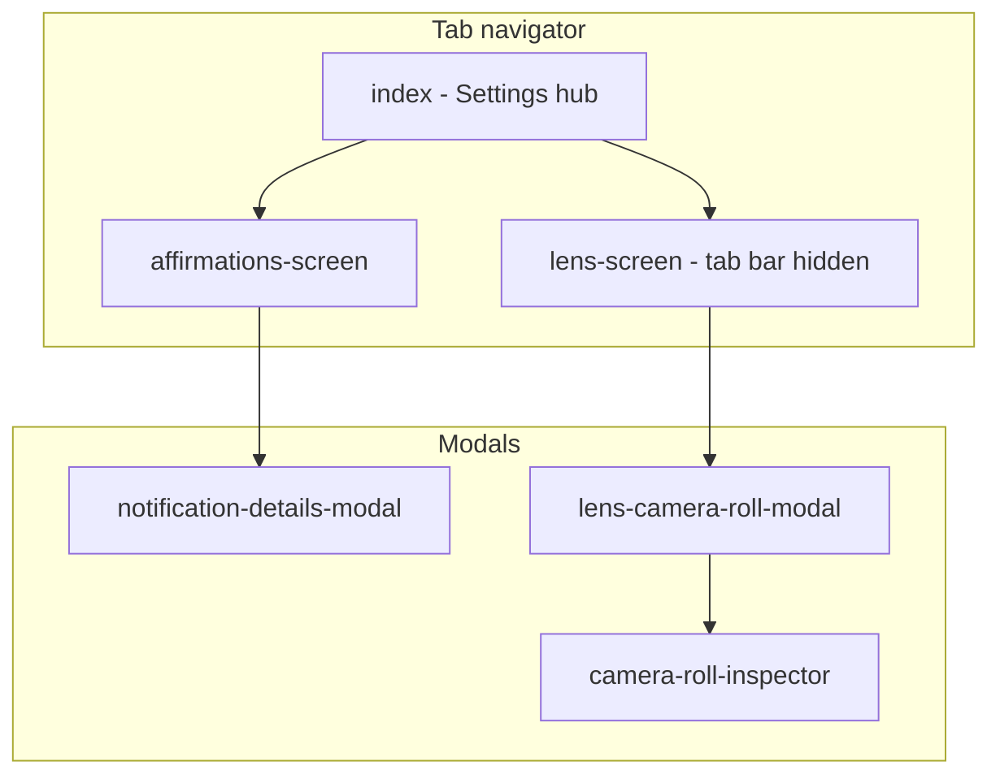

# Scheduled Affirmations

A React Native / Expo app for scheduling and managing affirmations with local notifications, plus an advanced **Lens** camera: live color-palette extraction on iOS (**color lens**) and a Skia GPU filter path (**Obskura**). Display name and version come from [`app.json`](app.json) (**Scheduled Affirmations**, v2.0.1); Expo slug: `affirmations`.

## Features

### Core functionality

- **Affirmation scheduling**: Title, message, and date/time validation via `Scheduler`
- **Pending and history**: Pill toggle between pending and sent lists (`ScheduleHistory`)
- **Gestures and details**: Swipe-to-delete on rows (`workletGestures`); notification details modal; cancel and edit flows
- **Push notifications**: Permission handling, Expo push token registration (`registerForPushNotificationsAsync`, `resolveExpoProjectId`); affirmations UI gated until a token is available
- **Permissions**: Camera, microphone, and media library handling for Lens

### Camera and Lens

| Area | What it does |
|------|----------------|
| **View modes** | **Lens** (palette + standard camera) vs **Obskura** (Skia live preview and still export) — `CAMERA_VIEW_MODE` in [`lib/features/Lens/Camera/options.ts`](lib/features/Lens/Camera/options.ts) |
| **Color lens** (Lens mode) | Live 8-swatch palette from frames; palette saved on photo capture when enabled — **iOS only** (native frame processor) |
| **Obskura** | Skia GPU filter; color modes `default` and `tame-red`; **photo only** (no video) |
| **Capture** | Tap for photo; long-press for video when color lens is **off** and view mode is **Lens** (not Obskura) |
| **Shared controls** | Grid, flash, physical device selection, front/back flip, tap-to-focus, camera roll thumbnail with modal and inspector |
| **Platform** | **Obskura** on iOS and Android; **color lens** requires the local iOS plugin — not shipped for Android yet |

Full Lens architecture, platform matrix, and debugging: [`lib/features/Lens/README.md`](lib/features/Lens/README.md).

### Technical features

- **New Architecture** enabled (`newArchEnabled: true` in `app.json`)
- **TypeScript** throughout `lib/`
- **Co-located tests**: `*.spec.tsx` / `*.spec.ts` next to implementation files
- **State**: React Context + `useReducer` under [`lib/platform/`](lib/platform/)
- **Routing**: Expo Router — tabs and modals
- **AI / editor conventions**: [`.cursorrules`](.cursorrules) and [`.cursor/rules/`](.cursor/rules/)

## Tech stack

### Core framework

- **Expo SDK** 53.0.27
- **React** 19.0.0
- **React Native** 0.79.6
- **Expo Router** 5.1.11
- **TypeScript** 5.8.3

### Camera and graphics

- **react-native-vision-camera** 4.7.0
- **react-native-reanimated** 3.17.5
- **react-native-worklets-core** 1.5.0
- **@shopify/react-native-skia** v2.0.0-next.4
- **expo-color-lens-frame-processor** — local package at [`modules/expo-color-lens-frame-processor`](modules/expo-color-lens-frame-processor)

### Notifications and storage

- **expo-notifications** 0.31.5
- **@react-native-async-storage/async-storage** 2.1.2

### UI and platform

- Themed components (`ThemedView`, `ThemedText`, `ThemedButton`, …)
- **react-native-gesture-handler**, **react-native-safe-area-context**
- **expo-image**, **expo-blur**, **expo-symbols**, **expo-media-library**, **expo-haptics**, and related Expo modules (see [`package.json`](package.json))

### Development

- **Jest** 29 + **jest-expo** 53 + **@testing-library/react-native**
- **ESLint** + **Prettier**

## App structure

### Navigation



Route names and paths: [`lib/routes/routes.ts`](lib/routes/routes.ts). The Lens tab hides the bottom tab bar while focused ([`app/(tabs)/_layout.tsx`](app/(tabs)/_layout.tsx)).

### Screens

1. **Home** ([`lib/screens/Home.tsx`](lib/screens/Home.tsx)) — settings and navigation hub
2. **Lens** — full-screen camera (Lens + Obskura)
3. **Affirmations** — scheduler and schedule history when push setup is complete

### State management

- Global **Context** with feature **actions** and **reducers** in [`lib/platform/`](lib/platform/)
- **Affirmations**: pending/history notifications, scheduling helpers
- **Lens**: `lensPalettesMap` — color palettes keyed to captured media, hydrated from storage

## Design system

- **Themes**: Light/dark via system scheme and `useThemeColor`
- **Tokens**: Semantic colors ([`lib/styles/colors.ts`](lib/styles/colors.ts)), 4px-based spacing ([`lib/styles/spacing.ts`](lib/styles/spacing.ts)), shared layouts ([`lib/styles/globalStyles.ts`](lib/styles/globalStyles.ts))
- **Components**: Themed primitives and shared UI under [`lib/components/`](lib/components/)

Styling conventions for contributors: [`.cursorrules`](.cursorrules) (styling sections).

## Prerequisites

Before developing Lens or running native builds:

- **Node.js** — Use a version supported by [Expo SDK 53](https://docs.expo.dev/) (no `engines` field in this repo; follow current Expo LTS guidance)
- **npm** — **10.9.2** via `packageManager` in `package.json`; `preinstall` runs `corepack enable`
- **iOS** — Recent **Xcode**, **CocoaPods** (`npm run podpod` after native changes)
- **Android** — **Android Studio**, SDK, emulator or device
- **Dev client** — **Required** for Lens: Vision Camera, worklets, Skia, and the iOS frame processor do **not** run in Expo Go alone. Use `npm run ios` / `npm run android` or an EAS development build
- **Watchman** (optional, macOS) — Referenced in the `nuke` script for cache resets

## Development

### Getting started

1. Install dependencies:

   ```bash
   npm install
   ```

2. First-time or after native module changes:

   ```bash
   npm run recharge
   ```

   This runs `npm i`, `npx expo install`, `npx expo prebuild`, and `podpod` (iOS pods).

3. Run on a simulator or device:

   ```bash
   npm run ios
   # or
   npm run android
   ```

4. Start Metro (use `--clear` after Babel or worklets changes):

   ```bash
   npm start
   npm start -- --clear
   ```

### Available scripts

```bash
# Development
npm start                 # Expo dev server
npm run ios               # expo run:ios (dev client)
npm run android           # expo run:android (dev client)
npm run web               # expo start --web

# Code quality
npm run lint              # ESLint (expo lint)
npm run ts                # tsc --noEmit
npm run format            # Prettier write
npm run format:check      # Prettier check

# Testing
npm test                  # Jest
npm run test:all          # Jest watch mode
npm run test:coverage:lens
npm run test:coverage:affirmations

# Native hygiene
npm run nuke              # Remove node_modules, jest cache, coverage; reinstall
npm run nuke:full         # Also remove ios/ and android/, then nuke
npm run nuke:start        # nuke + recharge + ios
npm run nuke:fullstart    # nuke:full + recharge + ios
npm run recharge          # install + expo install + prebuild + podpod
npm run podpod            # cd ios && pod install

# Version bumps (app.json / related)
npm run version:patch
npm run version:minor
npm run version:major
```

### Project structure

```
affirmations/
├── app/                    # Expo Router (tabs + modals)
│   ├── (tabs)/
│   ├── (modals)/
│   └── _layout.tsx
├── lib/
│   ├── components/
│   ├── features/
│   │   ├── Affirmations/
│   │   └── Lens/           # Camera, Obskura, ColorPalette — see Lens/README.md
│   ├── platform/           # actions, reducers, context
│   ├── routes/
│   ├── screens/
│   ├── styles/
│   ├── testing/            # Shared test utilities — see testing/README.md
│   └── utils/
├── modules/
│   └── expo-color-lens-frame-processor/
├── plugins/                # e.g. withFmtXcode26Podfile.js
├── .cursor/rules/
├── assets/
├── ios/ android/           # Generated after prebuild
├── app.json
├── eas.json
└── package.json
```

## Testing

Tests use **Jest** and **React Native Testing Library**. Shared helpers live in [`lib/testing/README.md`](lib/testing/README.md), including:

- `renderWithContext` / `renderRouterWithContext` for providers and navigation
- Date/time picker mocks
- `getObskuraVisionCameraJestMock` for Vision Camera in Lens tests

Philosophy (see [`.cursor/rules/affirmations-testing.mdc`](.cursor/rules/affirmations-testing.mdc)): prefer **`findBy*`** queries first; assert user-visible behavior, not implementation details.

```bash
npm test
npm run test:all
npm test -- path/to/file.spec.tsx
npm run test:coverage:lens          # 100% thresholds on selected Lens files
npm run test:coverage:affirmations  # 100% thresholds on Affirmations feature files
```

## Building

Use [EAS Build](https://docs.expo.dev/build/introduction/) with profiles in [`eas.json`](eas.json):

```bash
# Development (internal distribution, debug iOS)
eas build --profile development --platform ios
eas build --profile development --platform android

# Preview / production
eas build --profile preview --platform all
eas build --profile production --platform ios
eas build --profile production --platform android
```

There is no `npm run build` script in this repo — native runs use `expo run:*` locally; release artifacts use EAS.

## Key features

### Affirmations and notifications

- Schedule local notifications with validated title, message, and trigger time
- Separate **pending** and **history** lists with sorting by trigger date
- Modal flow for notification details; swipe and actions for management
- History persisted via AsyncStorage; custom notification sounds where configured

### Lens (summary)

- Toggle **Lens** vs **Obskura** without leaving the camera screen
- **Color lens**: real-time swatches and palette persistence on capture (iOS)
- **Obskura**: Skia-painted stills and live preview at reduced FPS for stability
- Camera roll integration with inspector sub-route

**Full architecture, FPS limits, and platform matrix:** [`lib/features/Lens/README.md`](lib/features/Lens/README.md)

### State and persistence

- Immutable reducer updates for affirmations and lens palette map
- Lens palettes loaded on mount (`useInitLensPalettes`) and saved when captures complete
- Type-safe actions from [`lib/platform/actions/`](lib/platform/actions/)

## Contributing

1. Fork the repository (if applicable to your workflow)
2. Create a feature branch
3. Match conventions in [`.cursorrules`](.cursorrules) — imports, themed components, co-located tests
4. Add or update tests for behavior you change
5. Run `npm run ts`, `npm run lint`, and `npm test`
6. Open a pull request with a clear description and test notes

## License

This project is private and proprietary.

## Support

For issues:

- Search existing issues first
- File a new issue with steps to reproduce, expected vs actual behavior, and device/OS details

## Roadmap and direction

### Shipped (foundation)

- Affirmation scheduling, pending/history UI, and notification details flow
- Lens camera with **Obskura** (cross-platform Skia path)
- **iOS color lens** via `expo-color-lens-frame-processor`
- Co-located Jest coverage with strict gates for Lens and Affirmations surfaces
- React Native New Architecture enabled

### Near-term (2026)

Grounded in current gaps documented in [`lib/features/Lens/README.md`](lib/features/Lens/README.md#known-limitations):

- **Android color lens** — ship frame processor in the local Expo module (today: Apple-only in module config)
- **Focus ring UI** — `useCameraFocus` exposes animation; ring not rendered in `Camera.tsx`
- **Frame processor dependencies** — align worklet closure deps with Vision Camera guidance
- **Lens provider** — finish provider/install TODOs in `Lens.tsx` / `useInitLensPalettes`
- **Permission and test hygiene** — media-library effect deps, remove debug logs, small export/test mismatches

### Medium term (2026–2027)

- Richer affirmation personalization (templates, categories) without over-scoping the core scheduler
- Deeper color / mood tie-ins using stored palettes (grounded in data you already capture)
- Optional biometric or wellness integrations only where privacy and permissions are explicit

### Longer term

- Community or shared affirmation flows with strong privacy defaults
- Broader wellness integrations (partnerships, analytics) if product direction warrants it

The modular platform layer (context + feature reducers) and the frame-processor / Skia split (real-time native vs GPU filter) are intentional: new sensing or AI features can plug in without rewriting navigation or affirmations core.

---

Further reading: [Lens developer guide](lib/features/Lens/README.md) · [Testing utilities](lib/testing/README.md)

Built with React Native and Expo.
