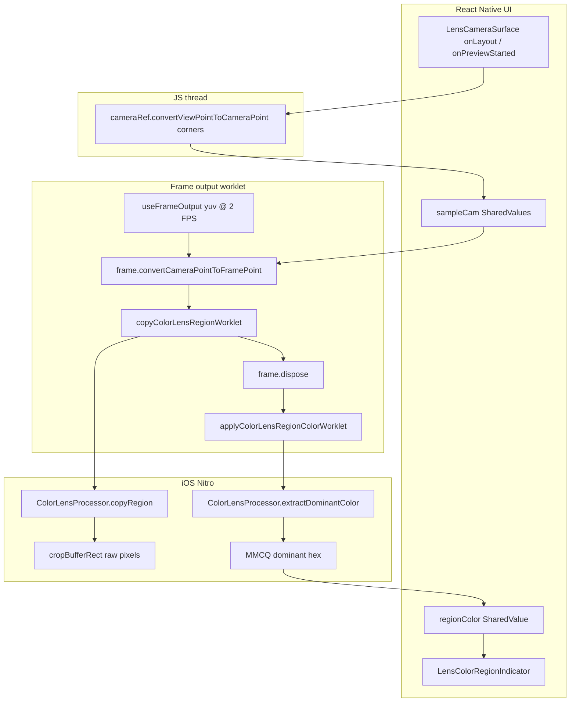

# Lens Point — UI + Native Context

Handoff doc for **lens-point** color sampling (`COLOR_LENS_MODE.LENS_POINT`). Describes how the on-screen indicator, JS frame output, VC5 coordinate conversions, and iOS Nitro processor connect.

**Dominant** palette mode uses the same frame output with `react-native-vision-camera-resizer` (GPU cover crop) → `ColorLensProcessor.extractPalette(ArrayBuffer)`.

---

## Product behavior (today)

- User cycles color-lens mode via top controls: `disabled → lens-dominant → lens-point → disabled`.
- In **lens-point** mode:
  - A **fixed-center** indicator sits over the camera preview (no drag yet).
  - Live sampled hex drives the **inner ring** border color (animated).
  - Photo capture saves the current `regionColor` with the asset.
- **Not implemented yet:** movable/draggable lens point. Stage 2 coords make this straightforward: update the view-space sample square on drag, re-run `convertViewPointToCameraPoint` on the JS thread.

---

## Single config — tune everything from one object

[`lib/features/Lens/Camera/lensPointSampleRegion.ts`](Camera/lensPointSampleRegion.ts)

```typescript
export const LENS_POINT_REGION = {
  sampleRadius: 0.01,       // view-space sample square + inner ring (1:1)
  haloMultiplier: 8,          // outer halo diameter only (UI)
  innerBorderWidth: 1,
  haloBorderWidth: 2,
  haloBorderOpacity: 0.4,
} as const;
```

| Field | Affects |
|-------|---------|
| `sampleRadius` | View-space sample square **and** inner ring diameter |
| `haloMultiplier` | Outer halo size only (`sampleRadius × multiplier`) |
| `innerBorderWidth` / `haloBorderWidth` / `haloBorderOpacity` | Indicator chrome only |

Helpers:

- `getRegionDiameter(layout)` → inner ring px (`2 × sampleRadius × shortSide`)
- `getRegionHaloDiameter(layout)` → outer halo px (`2 × haloRadius × shortSide`)

---

## End-to-end data flow



**Rule:** View→camera conversion runs on the **JS thread** (preview throws until ready). Camera→frame conversion runs in the **worklet**. Native only crops a raw pixel rect.

**Buffer rule:** Dispose the camera `Frame` **before** MMCQ. Hold time is only the CI crop/copy (point) or Metal resize (dominant); owned pixel buffers keep analysis off the camera pool.

---

## UI layer

### [`LensCameraSurface.tsx`](Camera/LensCameraSurface.tsx)

- `resizeMode="cover"` on `Camera`.
- `useFrameOutput({ pixelFormat: 'yuv', enablePreviewSizedOutputBuffers: true, onFrame })`.
- On layout / preview started / device flip: build the view-space sample square (center = viewport center, half-size = `sampleRadius × min(w,h)`), convert opposite corners with `cameraRef.convertViewPointToCameraPoint`, store camera-space corners in SharedValues. Skip region sampling until ready (`sampleCamReady`).
- Point-mode worklet (throttled `COLOR_LENS_REGION_TARGET_FPS` = 2):

```typescript
const framePoint1 = frame.convertCameraPointToFramePoint({ x: sampleCamX1.value, y: sampleCamY1.value })
const framePoint2 = frame.convertCameraPointToFramePoint({ x: sampleCamX2.value, y: sampleCamY2.value })
const regionPixels = copyColorLensRegionWorklet(frame, {
  left: Math.min(framePoint1.x, framePoint2.x),
  top: Math.min(framePoint1.y, framePoint2.y),
  right: Math.max(framePoint1.x, framePoint2.x),
  bottom: Math.max(framePoint1.y, framePoint2.y),
})
frame.dispose() // before MMCQ — avoids out-of-buffers
if (regionPixels !== null) {
  applyColorLensRegionColorWorklet(regionPixels)
}
```

- Dominant mode: `useResizer` → **`frame.dispose()`** → `extractPalette(gpu.getPixelBuffer(), w, h)` → `gpuFrame.dispose()`.
- Renders [`LensColorRegionIndicator`](Camera/LensColorRegionIndicator.tsx) when `isColorLensPoint(colorLensMode)`.

### JS bridge

| File | Role |
|------|------|
| [`useColorLensRegion.ts`](ColorPalette/useColorLensRegion.ts) | `copyColorLensRegionWorklet` + `applyColorLensRegionColorWorklet` (mutate `regionColor` after dispose) |
| [`getColorLensRegion.ts`](ColorPalette/getColorLensRegion.ts) | `copyRegion` / `extractDominantColor` wrappers |
| [`useColorLensPalette.ts`](ColorPalette/useColorLensPalette.ts) | Mutates palette SharedValues on the frame thread |
| [`getColorLensPalette.ts`](ColorPalette/getColorLensPalette.ts) | Calls `getColorLensProcessor().extractPalette(pixels, width, height)` |

---

## Native layer (iOS)

Module: [`modules/expo-color-lens-frame-processor/`](../../../modules/expo-color-lens-frame-processor/)

Single HybridObject: **`ColorLensProcessor`** (`HybridColorLensProcessor.swift`), created lazily via `getColorLensProcessor()`.

### `copyRegion(frame, left, top, right, bottom)` → `{ pixels, width, height }`

1. Unwrap `NativeFrame` → `CVPixelBuffer`.
2. [`ColorLensImagePipeline.cropBufferRect`](../../../modules/expo-color-lens-frame-processor/ios/ColorLensImagePipeline.swift) — clamp rect, flip Y for CI origin, crop.
3. Downsample (max side 128) → `CIContext.render` BGRA → **owned** `ArrayBuffer` copy.
4. Native throttle (~20 FPS) returns `nil` when skipped; JS throttles to 2 FPS.

### `extractDominantColor(pixels, width, height)` → hex

1. Copy BGRA `ArrayBuffer` into reused buffer → MMCQ → dominant hex.
2. Temporal smoothing. Call **after** disposing the camera `Frame`.

### `extractPalette(pixels, width, height)`

1. Copy uint8 RGB interleaved `ArrayBuffer` from the GPU resizer.
2. MMCQ stride-3 RGB reader → up to 6 colors + background/detail.
3. No CIContext / cover math on this path.

---

## Coordinate spaces (important for future drag work)

| Space | Who produces it |
|-------|-----------------|
| View pixels | Layout + `LENS_POINT_REGION.sampleRadius` |
| Camera normalized | `convertViewPointToCameraPoint` (JS thread) |
| Frame / buffer pixels | `convertCameraPointToFramePoint` (worklet) |

**Future drag:** update the view-space square from the gesture, re-convert corners on the JS thread, keep the same worklet → native path.

---

## Vision Camera / platform notes

- **v5.2.3** — uses VC5 coordinate APIs + `react-native-vision-camera-resizer@5.2.3`.
- **Android:** color-lens processor is iOS-only (`HybridObject<{ ios: 'swift' }>`).
- **Native changes require dev client rebuild** (`npx expo run:ios`).

---

## Key files checklist

| Concern | Path |
|---------|------|
| Config + diameter math | [`Camera/lensPointSampleRegion.ts`](Camera/lensPointSampleRegion.ts) |
| Camera + frame output | [`Camera/LensCameraSurface.tsx`](Camera/LensCameraSurface.tsx) |
| Resizer size helper | [`Camera/resizerOutputSize.ts`](Camera/resizerOutputSize.ts) |
| On-screen rings | [`Camera/LensColorRegionIndicator.tsx`](Camera/LensColorRegionIndicator.tsx) |
| Region / palette hooks | [`ColorPalette/useColorLensRegion.ts`](ColorPalette/useColorLensRegion.ts), [`useColorLensPalette.ts`](ColorPalette/useColorLensPalette.ts) |
| Nitro processor | [`modules/.../HybridColorLensProcessor.swift`](../../../modules/expo-color-lens-frame-processor/ios/HybridColorLensProcessor.swift) |
| Thin CI crop helpers | [`modules/.../ColorLensImagePipeline.swift`](../../../modules/expo-color-lens-frame-processor/ios/ColorLensImagePipeline.swift) |

---

## Deferred / out of scope

- Draggable lens point.
- Circular sample mask vs square native crop.
- Android native implementation.
- Package rename away from `expo-color-lens-frame-processor`.
