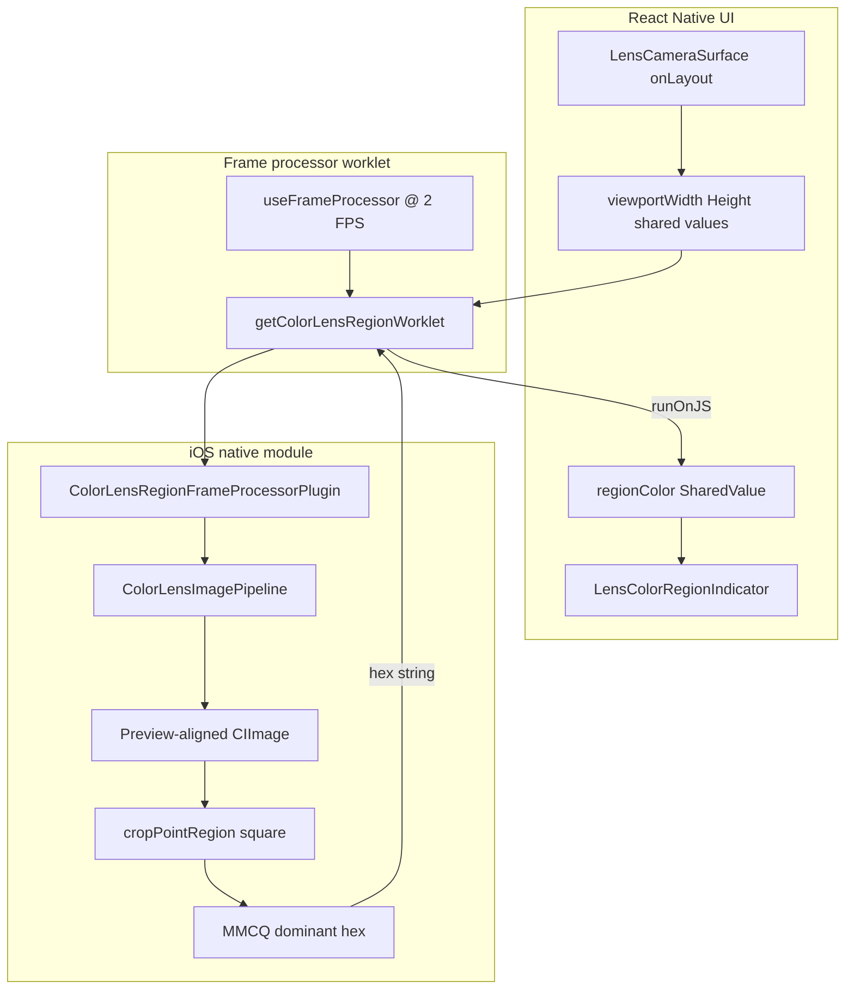

# Lens Point — UI + Native Context

Handoff doc for **lens-point** color sampling (`COLOR_LENS_MODE.LENS_POINT`). Describes how the on-screen indicator, JS frame processor, and iOS native pipeline connect. **Dominant** palette mode shares the same native preview-alignment foundation but samples the full visible preview (no point crop).

---

## Product behavior (today)

- User cycles color-lens mode via top controls: `disabled → lens-dominant → lens-point → disabled`.
- In **lens-point** mode:
  - A **fixed-center** indicator sits over the camera preview (no drag yet).
  - Live sampled hex drives the **inner ring** border color (animated).
  - Photo capture saves the current `regionColor` with the asset.
- **Not implemented yet:** movable/draggable lens point (gestures, shared drag coords). Native pipeline already accepts arbitrary `centerX` / `centerY` in view-normalized space on the preview-aligned image.

---

## Single config — tune everything from one object

[`lib/features/Lens/Camera/lensPointSampleRegion.ts`](Camera/lensPointSampleRegion.ts)

```typescript
export const LENS_POINT_REGION = {
  sampleRadius: 0.01,       // native crop + inner ring (1:1)
  haloMultiplier: 8,          // outer halo diameter only (UI)
  innerBorderWidth: 1,
  haloBorderWidth: 2,
  haloBorderOpacity: 0.4,
} as const;
```

| Field | Affects |
|-------|---------|
| `sampleRadius` | Native square crop **and** inner ring diameter |
| `haloMultiplier` | Outer halo size only (`sampleRadius × multiplier`) |
| `innerBorderWidth` / `haloBorderWidth` / `haloBorderOpacity` | Indicator chrome only |

Helpers:

- `getRegionDiameter(layout)` → inner ring px (`2 × sampleRadius × shortSide`)
- `getRegionHaloDiameter(layout)` → outer halo px (`2 × haloRadius × shortSide`)

Legacy re-exports: `LENS_POINT_SAMPLE_RADIUS`, `LENS_POINT_HALO_MULTIPLIER`, `LENS_POINT_HALO_RADIUS`.

---

## End-to-end data flow



**Rule:** JS passes **viewport size + normalized center/radius only**. All cover/orientation/mirror/crop/MMCQ happens in Swift.

---

## UI layer

### [`LensCameraSurface.tsx`](Camera/LensCameraSurface.tsx)

- `resizeMode="cover"` on `ReanimatedCamera`.
- Surface `onLayout` → `viewportWidth` / `viewportHeight` shared values (for native cover math).
- Point-mode frame processor (throttled `COLOR_LENS_REGION_TARGET_FPS` = 2):

```typescript
getColorLensRegionWorklet(frame, {
  centerX: 0.5,
  centerY: 0.5,
  radius: LENS_POINT_REGION.sampleRadius,
  viewportWidth: viewportWidth.value,
  viewportHeight: viewportHeight.value,
});
```

- Renders [`LensColorRegionIndicator`](Camera/LensColorRegionIndicator.tsx) when `isColorLensPoint(colorLensMode)`.
- Photo flow: `onPhotoCaptureStart` snapshots `regionColor.value` → `requestColorNames` → persisted lens palette.

### [`LensColorRegionIndicator.tsx`](Camera/LensColorRegionIndicator.tsx)

Two concentric **transparent** rings, centered in overlay:

| Ring | Size | Border | Purpose |
|------|------|--------|---------|
| **Inner** (`lens-color-region-indicator`) | `getRegionDiameter` | 1px, full sampled color | Matches native sample patch |
| **Outer halo** (`lens-color-region-halo`) | `getRegionHaloDiameter` | 2px, sampled color @ 40% opacity | Visibility + future thumb aim target |

- `color` prop = `regionColor` shared value from `useColorLensRegion`.
- `useAnimatedColor` smooths border color transitions.
- `pointerEvents="none"` (drag not wired).
- Style arrays are `useMemo`'d for stable references.

### JS bridge hooks

| File | Role |
|------|------|
| [`useColorLensRegion.ts`](ColorPalette/useColorLensRegion.ts) | `getColorLensRegionWorklet` → native plugin → `runOnJS` → `regionColor` |
| [`getColorLensRegion.ts`](ColorPalette/getColorLensRegion.ts) | Worklet entry; calls `getColorLensRegion` frame processor plugin |
| [`colorLensRegionFrameProcessorPlugin.ts`](ColorPalette/colorLensRegionFrameProcessorPlugin.ts) | `VisionCameraProxy.initFrameProcessorPlugin('getColorLensRegion')` |

Dominant mode parallel path: [`useColorLensPalette.ts`](ColorPalette/useColorLensPalette.ts) + [`getColorLensPalette.ts`](ColorPalette/getColorLensPalette.ts) + `getColorLensPalette` plugin (viewport args only; no center/radius).

---

## Native layer (iOS)

Module: [`modules/expo-color-lens-frame-processor/`](../../../modules/expo-color-lens-frame-processor/)

### Shared pipeline — [`ColorLensImagePipeline.swift`](../../../modules/expo-color-lens-frame-processor/ios/ColorLensImagePipeline.swift)

Used by **both** region and dominant plugins.

1. Build `CIImage` from frame pixel buffer.
2. Read from `Frame`: `orientation`, `isMirrored`, buffer width/height.
3. **`makePreviewAlignedImage`**:
   - Apply orientation + front-camera mirror.
   - Flip to view coordinates (top-left origin).
   - **Cover crop** to match preview (`resizeMode="cover"`) using JS `viewportWidth` / `viewportHeight`.
   - Result = image that matches what the user sees on screen.
4. **`downsampleForMMCQ`** — longest side capped at **128px** (performance; not sample geometry).

Plugin args build `ColorLensPreviewContext`; if viewport ≤ 0, region plugin returns previous color.

### Point sampling — [`ColorLensRegionFrameProcessor.swift`](../../../modules/expo-color-lens-frame-processor/ios/ColorLensRegionFrameProcessor.swift)

After preview alignment:

1. **`cropPointRegion`** — square centered at `(centerX, centerY)` with side `2 × radius × shortSide` on the **aligned** image (not raw buffer).
2. Downsample → MMCQ (Color Thief–style median cut) → single dominant hex.
3. Temporal smoothing (squared RGB distance threshold 900).
4. Rate limit ~20 FPS internally (`minProcessingInterval = 0.05s`); JS throttles to 2 FPS.
5. **Invalid crop → `previousColor`** (no full-frame fallback).

Plugin callback requires: `viewportWidth`, `viewportHeight`, `centerX`, `centerY`, `radius`.

### Dominant sampling — [`ColorLensFrameProcessor.swift`](../../../modules/expo-color-lens-frame-processor/ios/ColorLensFrameProcessor.swift)

Same `makePreviewAlignedImage` → downsample **entire visible preview** → MMCQ up to 6 colors → palette dict.

---

## Coordinate spaces (important for future drag work)

After native preview alignment, **`centerX` / `centerY` are 0–1 in view space** on the aligned preview image (same space as the inner ring position).

- **Today:** fixed `(0.5, 0.5)` in JS; indicator centered in overlay.
- **Future drag:** update shared `centerX` / `centerY` from gesture; pass into `getColorLensRegionWorklet`; move indicator with same normalized values. **No JS cover/orientation math needed** — pipeline already handles it.

Inner ring diameter in px should stay tied to `LENS_POINT_REGION.sampleRadius` via `getRegionDiameter`. Halo stays UI-only via `haloMultiplier`.

---

## Vision Camera / platform notes

- **v4.7** — no `convertViewPointToCameraPoint`; native cover pipeline is the alignment strategy (Option C). See [`VISION_CAMERA_V4_VS_V5.md`](VISION_CAMERA_V4_VS_V5.md) and [`VISION_CAMERA_V5_MIGRATION.md`](VISION_CAMERA_V5_MIGRATION.md).
- **Android:** color-lens plugins are iOS-only today.
- **Native changes require dev client rebuild** (`npx expo run:ios`).

---

## Key files checklist

| Concern | Path |
|---------|------|
| Config + diameter math | [`Camera/lensPointSampleRegion.ts`](Camera/lensPointSampleRegion.ts) |
| Camera + frame processor | [`Camera/LensCameraSurface.tsx`](Camera/LensCameraSurface.tsx) |
| On-screen rings | [`Camera/LensColorRegionIndicator.tsx`](Camera/LensColorRegionIndicator.tsx) |
| Region hook | [`ColorPalette/useColorLensRegion.ts`](ColorPalette/useColorLensRegion.ts) |
| Plugin JS wrapper | [`ColorPalette/getColorLensRegion.ts`](ColorPalette/getColorLensRegion.ts) |
| Preview alignment | [`modules/.../ColorLensImagePipeline.swift`](../../../modules/expo-color-lens-frame-processor/ios/ColorLensImagePipeline.swift) |
| Point MMCQ plugin | [`modules/.../ColorLensRegionFrameProcessor.swift`](../../../modules/expo-color-lens-frame-processor/ios/ColorLensRegionFrameProcessor.swift) |
| Dominant MMCQ plugin | [`modules/.../ColorLensFrameProcessor.swift`](../../../modules/expo-color-lens-frame-processor/ios/ColorLensFrameProcessor.swift) |

---

## Tests

```bash
npm test -- lib/features/Lens/Camera/lensPointSampleRegion.spec.ts
npm test -- lib/features/Lens/Camera/LensColorRegionIndicator.spec.tsx
npm test -- lib/features/Lens/Camera/LensCameraSurface.spec.tsx
npm test -- lib/features/Lens/ColorPalette/useColorLensRegion.spec.ts
```

---

## Deferred / out of scope (next project)

- Draggable lens point (pan gesture, clamp helpers, `pointerEvents` on halo).
- Circular sample mask vs square native crop.
- Android native plugins.
- v5 Vision Camera migration + optional replacement of Swift cover math with VC coordinate APIs.
