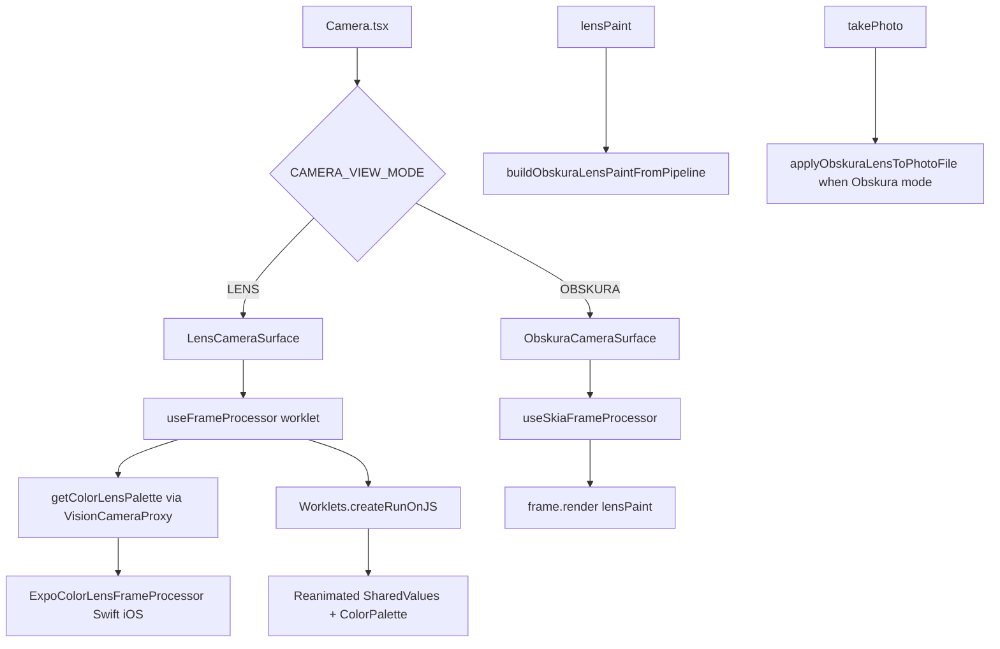

# Lens

Developer guide for the Affirmations **Lens** feature: camera capture (Vision Camera + Skia + worklets), live color palette extraction, saved palettes, and camera-roll browsing. For upstream library APIs, use the links in [Installed versions](#installed-versions) and [Further reading](#further-reading).

This document is affirmations-specific and describes **what the code in `lib/features/Lens/` does today**.

## Purpose

The Lens tab (`app/(tabs)/lens-screen.tsx` → `lib/features/Lens/Lens.tsx` → `lib/features/Lens/Camera/Camera.tsx`) provides an in-app camera with two **view modes** (see `CAMERA_VIEW_MODE` in `options.ts`):

| View mode | Mode toggle icon (when active) | What the user sees |
|-----------|-------------------------------|-------------------|
| **Lens** | `drop.fill` | Live camera preview; optional **color lens** (separate control) extracts a palette and animates swatches |
| **Obskura** | `camera.fill` | Live camera with a GPU blur/saturation/contrast **filter** (Skia frame processor via Obskura) |

**Controls are separate from view mode:**

| Control | Icon | When visible |
|---------|------|--------------|
| View mode toggle | `drop.fill` (Lens) / `camera.fill` (Obskura) | Always in top bar |
| Color lens toggle | `swatchpalette.fill` | Lens view mode only — enables palette extraction |

Both view modes share one `VisionCamera` ref, permissions, capture controls, and focus gestures. Only one surface component mounts at a time (`LensCameraSurface` or `ObskuraCameraSurface`).

## Feature layout

```
lib/features/Lens/
├── Lens.tsx                 # Tab screen shell; loads palettes from storage
├── LensCameraRoll.tsx       # Modal: paginated photo grid + palette strips
├── CameraRollInspector.tsx  # Modal sub-route: full-screen photo + palette overlay
├── Camera/                  # Vision Camera UI, Lens surface, hooks
├── Obskura/                 # GPU filter pipeline (React Native Skia; preview + still export)
├── ColorPalette/            # Live swatches, persistence types, roll thumbnails
└── README.md                # This file
```

Platform wiring (outside this folder): `lib/platform/actions/lens.ts`, `reducers/lens.ts`, `useLens()`; `app/(tabs)/lens-screen.tsx`; modals under `app/(modals)/lens-camera-roll-modal/`.

## Navigation and screens

```mermaid
flowchart LR
  Tab[lens-screen.tsx] --> Lens[Lens.tsx]
  Lens --> Camera[Camera.tsx]
  Camera -->|camera roll button| RollModal[lens-camera-roll-modal]
  RollModal --> LensCameraRoll[LensCameraRoll.tsx]
  LensCameraRoll -->|tap thumbnail| Inspector[camera-roll-inspector]
  Inspector --> CameraRollInspector[CameraRollInspector.tsx]
  CameraRollInspector --> ImageInspector[ColorPaletteImageInspector]
```



| Route | Component | Role |
|-------|-----------|------|
| `app/(tabs)/lens-screen.tsx` | `Lens` | Full-screen camera tab |
| `/(modals)/lens-camera-roll-modal` | `LensCameraRoll` | 3-column grid of library photos |
| `.../camera-roll-inspector` | `CameraRollInspector` | Single asset; palette overlay experiment |

The Lens tab is registered in the tab navigator but **hides the tab bar** while that screen is focused (`app/(tabs)/_layout.tsx` sets `tabBarStyle.display: 'none'` for the lens route). Users leave via the back chevron in `Camera.tsx` (`router.back()`).

## Palette persistence and global state

Captured palettes (when color lens was on at shutter time) are stored in app state and AsyncStorage.

| Piece | Location | Behavior |
|-------|----------|----------|
| Type | `ColorPalette/types.ts` | `LensPalette`: media `id`, `uri`, `mediaType`, plus eight hex keys (`primaryColor` … `detailColor`) |
| Map in state | `lib/platform/state` → `lens.lensPalettesMap` | `Record<assetId, LensPalette>` |
| Actions | `lib/platform/actions/lens.ts` | `onAddLensPalette`, `onSetLensPalettesMap` |
| Reducer | `lib/platform/reducers/lens.ts` | `ADD_LENS_PALETTE` merges by `payload.id`; `SET_LENS_PALETTES_MAP` replaces map |
| Hydration | `ColorPalette/useInitLensPalettes.ts` | On mount: `loadData(StorageDevice.LENS_PALETTES)` → `onSetLensPalettesMap`; when map non-empty after init, `saveData` |
| Capture write | `Camera.tsx` | After `takePhoto` + `createAssetAsync`, if color lens enabled, builds `LensPalette` and calls `onAddLensPalette` |

`useInitLensPalettes` runs from `Lens.tsx` before `Camera` mounts. There is a `// TODO: fnish installing` in that hook and a `// TODO: wrap with lens provider` in `Lens.tsx`—state today comes from the root `StateContextProvider`, not a Lens-specific provider.

**Live vs saved palettes**

| Source | UI | Data |
|--------|-----|------|
| **Live** (color lens on) | `ColorPalette` + `ColorSwatch` in camera top bar | Reanimated `SharedValue`s in `useColorLensPalette`, updated from frame processor |
| **Saved** (per asset id) | Strip on `ColorPaletteImage` in camera roll grid | `lensPalettesMap[asset.id]` from global state |
| **Inspector** | `ColorPaletteImageInspector` | Optional `palette` on route param `asset` (JSON); tap swatch to grow colored overlay |

Live palette keys are defined in `lensPaletteConfig.colorPaletteKeys` (eight swatches). Native extraction returns `primary` … `detail` (hex); `useColorLensPalette` maps those onto the shared values.

## Color palette UI (non-camera)

| File | Role |
|------|------|
| `ColorPalette.tsx` | Grid of `ColorSwatch` components bound to live shared values |
| `ColorSwatch.tsx` | Small tile; background driven by `useAnimatedColor` |
| `useAnimatedColor.ts` | `interpolateColor` + `withTiming` when a shared value changes (smooth live transitions) |
| `ColorPaletteImage.tsx` | Thumbnail + bottom strip of **static** swatches when a saved palette exists |
| `ColorPaletteImageInspector.tsx` | Full image; press swatch to animate a bottom-up overlay in that color |
| `getColorLensPalette.ts` | Worklet entry to native plugin (see [Lens mode](#lens-mode-color-palette-path)) |

## Camera subsystem (controls and media)

`Camera.tsx` orchestrates everything on the live capture screen:

| Area | Implementation |
|------|----------------|
| Device / position | `useCameraDevice` + `cameraDeviceOptions` / `CAMERA_POSITION` from `options.ts` |
| Permissions | `useLensPermissions` — camera, mic, media library on mount |
| Grid overlay | `CameraGrid` — rule-of-thirds `Divider` lines when grid mode on |
| Recent thumbnail | `useCameraRoll` — latest library asset URI + fade/scale animation; opens roll modal |
| Video | `startRecording` / `stopRecording`; `createAssetAsync` on finish (no Obskura post-process) |
| Photo | `takePhoto` → Obskura post-process in Obskura mode, or direct save / palette attach in Lens mode |
| Top bar | View mode, grid, flash, flip, multi-camera device, color lens toggle, Obskura color mode, live `ColorPalette` |

See [Shared conventions](#shared-conventions-fps-video-focus), [Lens mode](#lens-mode-color-palette-path), and [Obskura mode](#obskura-mode-filter-path) for frame processors and FPS.

## Camera roll modal

`LensCameraRoll.tsx`:

- Loads photos via `expo-media-library` `getAssetsAsync` (paginated with `endCursor` / `onEndReached`).
- Seeds from `getCameraRollPhotosCache()` / updates `setCameraRollPhotosCache()` in `@storage/cache` for faster reopen.
- Each cell: `PhotoGridItem` → `ColorPaletteImage` (photo + palette strip if `lensPalettesMap[item.id]`).
- Tap navigates to inspector with `asset` serialized as JSON in route params.

`CameraRollInspector.tsx` parses that JSON into `InspectionAsset` and renders `ColorPaletteImageInspector`.

## Installed versions

| Package | Version in `package.json` | Notes |
|---------|---------------------------|--------|
| `react-native-vision-camera` | 4.7.0 | v5 is current upstream; this app uses the v4 API |
| `react-native-worklets-core` | 1.5.0 | Babel plugin required for frame worklets |
| `@shopify/react-native-skia` | v2.0.0-next.4 | Requires RN ≥0.79, React ≥19 (matches this app) |

Peer dependencies for frame processors and Skia preview are satisfied in `package.json`.

## The three libraries (roles in this app)

| Library | Role here | Official docs |
|---------|-----------|---------------|
| **Vision Camera** | Camera device selection, preview, `takePhoto` / video recording, hosts `useFrameProcessor` and `useSkiaFrameProcessor` | [visioncamera.margelo.com](https://react-native-vision-camera.com/) · [GitHub](https://github.com/mrousavy/react-native-vision-camera) |
| **react-native-worklets-core** | Compiles functions marked with `'worklet'`; `Worklets.createRunOnJS` bridges from the camera frame thread back to React/Reanimated | [GitHub](https://github.com/margelo/react-native-worklets-core) |
| **React Native Skia** | GPU image filters on the live preview (`useSkiaFrameProcessor`) and offscreen still export (`applyObskuraLensToPhotoFile`) | [Installation](https://shopify.github.io/react-native-skia/docs/getting-started/installation) |

**Reanimated** is not part of the frame pipeline, but it is required on this screen for `Reanimated.createAnimatedComponent(VisionCamera)`, tap-to-focus (`runOnJS`), palette UI, and camera-roll preview animations. Reanimated worklets and worklets-core are **different systems**—see [Reanimated's role](#reanimateds-role).

## Runtime picture



### Two JavaScript runtimes

Vision Camera runs frame processors in a **dedicated JS runtime** (separate from React's). `useFrameProcessor` / `useSkiaFrameProcessor` take a **dependency array**; when deps change, the processor is recreated and copied into that runtime. Values used inside the worklet must either be in that dependency list or be worklet-safe shared values.

React state (`useState`) read from a worklet closure without being listed in deps can go **stale**. That is why `getColorLensPaletteWorklet` should appear in `LensCameraSurface`'s dependency array (see [Known limitations](#known-limitations)).

## Shared conventions (FPS, video, focus)

| Concern | Behavior in `Camera.tsx` |
|---------|---------------------------|
| Preview FPS (Lens, color lens **off**) | **30** (`DEFAULT_FPS`) |
| Preview FPS (Lens, color lens **on**, screen active) | **15** (`COLOR_LENS_FPS`) |
| Preview FPS (Obskura view mode) | **15** (`OBSKURA_FPS` on `ObskuraCameraSurface` only) |
| Video (long-press capture) | Allowed only in Lens mode with color lens off (`isVideoNotAllowed` when color lens is on or Obskura view mode is active) |
| Frame processors when backgrounded | `isCameraActive` false via `useFocusEffect`; surfaces pass `frameProcessor={isActive ? processor : undefined}` |
| Tap to focus | `Gesture.Tap` → `runOnJS(handleFocusTap)` → `camera.focus({ x, y })` with **x/y relative to the camera `GestureDetector` view** (not normalized 0–1) |
| Focus ring UI | Not rendered today; `useCameraFocus` still builds `focusIndicatorAnimatedStyle` using **window** `Dimensions` for percentage layout—fix that if the ring is added |

Frame processors stay enabled when `react-native-worklets-core` is installed and the Babel plugin is configured. The Vision Camera Expo plugin does **not** set `enableFrameProcessors: false`.

## Lens mode (color palette path)

Used when `cameraViewMode === CAMERA_VIEW_MODE.LENS`.

### Live preview flow

1. **`LensCameraSurface`** mounts `ReanimatedCamera` with `useFrameProcessor` whenever the screen is active (even when color lens is off—the worklet runs each frame but skips palette work until color lens is enabled).
2. Each frame, the worklet runs on the camera thread (`'worklet'` directive required).
3. If color lens is enabled and at least **1000 ms** have passed since the last sample (`COLOR_LENS_PALETTE_MIN_INTERVAL_MS`), it calls `getColorLensPaletteWorklet(frame)`.
4. **`getColorLensPaletteWorklet`** (`useColorLensPalette.ts`) calls native **`getColorLensPalette`** (`getColorLensPalette.ts`):
   - `VisionCameraProxy.initFrameProcessorPlugin('getColorLensPalette')`
   - Plugin implemented in `modules/expo-color-lens-frame-processor` (iOS only).
5. Native Swift (`ColorLensFrameProcessor.swift`) downsamples the frame, runs MMCQ palette extraction (up to **6** dominant colors mapped to primary/secondary/…/detail), applies temporal smoothing, and caps work at roughly **20 FPS** (`minProcessingInterval` 0.05s).
6. Result returns to the worklet; **`Worklets.createRunOnJS(applyColorPalette)`** updates Reanimated shared values.
7. **`ColorPalette`** reads those shared values and animates swatches on the React thread.

### Capture flow (lens mode)

1. `camera.current.takePhoto({ flash, enableShutterSound })`.
2. If color lens was enabled, snapshot current palette from shared values and call `onAddLensPalette` with the new media-library asset and palette.
3. Otherwise save the raw photo via `createAssetAsync(photo.path)`.
4. Refresh camera-roll thumbnail via `useCameraRoll`.

Video recording (long-press capture) is allowed only in **Lens mode with color lens off**. `isVideoNotAllowed = isColorLensEnabled || isObskuraMode` in `Camera.tsx`—so video is disabled when color lens is on **or** when Obskura view mode is active (photo only in Obskura).

### FPS

In Lens view mode, `Camera.tsx` passes `fps` to `LensCameraSurface`: **15** when `isCameraActive && isColorLensEnabled`, else **30**. Color lens off does **not** lower FPS. Obskura view mode always uses **15** on `ObskuraCameraSurface`, independent of color lens.

## Obskura mode (filter path)

Used when `cameraViewMode === CAMERA_VIEW_MODE.OBSKURA`.

### Live preview flow

1. **`ObskuraCameraSurface`** selects a camera format via **`useCameraFormat`** with **`Templates.FrameProcessing`** (~1080×720 video for the frame processor) and **`photoResolution: 'max'`** for full-quality stills.
2. Builds a **`SkPaint`** via `buildObskuraLensPaintFromPipeline(OBSKURA_LENS_PIPELINE, { colorMode })` (memoized per mode).
3. **`useSkiaFrameProcessor`** receives frames at the format’s video resolution; the worklet calls `frame.render(lensPaint)`.
4. Filter chain: optional erode → Gaussian blur → tone curve (image filters), then brightness → contrast → saturation (color matrices; tame-red when `colorMode` is TAME_RED). Blur sigma is tuned via `OBSKURA_LENS_BLUR_SIGMA` in `pipeline/obskuraLensPipelineConfig.ts` and scaled for full-res still export.
5. Preview FPS is fixed at **15** (`OBSKURA_FPS` in `Camera.tsx`). Obskura mounts **`photo` only** (no `video` / `audio` pipelines).

### Capture flow (Obskura mode)

1. `takePhoto` returns an unfiltered file path from the camera.
2. **`applyObskuraLensToPhotoFile`** decodes the image with React Native Skia, draws through the **same** pipeline (with `outputShortSidePx` so blur matches preview), encodes JPEG to cache, returns `file://` URI.
3. `createAssetAsync(paintedUri)` saves to the photo library.

### Resource lifecycle

- `lensPaint.dispose()` in `ObskuraCameraSurface` when `colorMode` changes or the component unmounts.
- `applyObskuraLensToPhotoFile` disposes `SkImage`, `SkSurface`, `SkData`, and `SkPaint` in a `finally` block.

## Project wiring checklist

These must be correct for Lens to build and run on device:

| Item | Location |
|------|----------|
| Dependencies | `package.json`: vision-camera, worklets-core, skia, `expo-color-lens-frame-processor` (local module) |
| Worklets Babel plugin | `babel.config.js`: `react-native-worklets-core/plugin` **before** `react-native-reanimated/plugin` (Reanimated must be last) |
| Vision Camera Expo plugin | `app.json`: camera + microphone permission strings |
| Media library plugin | `app.json`: save/read photos permissions |
| iOS usage strings | `app.json` → `ios.infoPlist` NSCameraUsageDescription, NSMicrophoneUsageDescription |
| New Architecture | `app.json` → `newArchEnabled: true` (enabled for this Expo SDK 53 project; Skia requires RN ≥0.79 / React ≥19, not New Arch by itself) |
| Web worklets stub | `metro.config.js` resolves `react-native-worklets-core` to `lib/shims/workletsCoreWebStub.ts` on web (bundle safety only; Lens is not a web camera feature) |
| Native module | After changing `modules/expo-color-lens-frame-processor`: `npx expo prebuild`, `cd ios && pod install`, restart Metro with `--reset-cache` |

## Reanimated's role

| Use case | Mechanism | File(s) |
|----------|-----------|---------|
| Animated camera `isActive` | `Reanimated.createAnimatedComponent(VisionCamera)` + `addWhitelistedNativeProps({ isActive: true })` | `LensCameraSurface.tsx`, `Obskura/ObskuraCameraSurface.tsx` |
| Tap to focus | `Gesture.Tap` → `runOnJS(handleFocusTap)` → `camera.focus({ x, y })` in view space | `Camera.tsx`, `useCameraFocus.ts` |
| Palette swatch colors | Shared values updated from frame path | `useColorLensPalette.ts`, `ColorPalette.tsx` |
| Camera roll thumbnail | `useAnimatedStyle` on preview container | `useCameraRoll.ts`, `Camera.tsx` |

**Do not** use Reanimated `runOnJS` inside `useFrameProcessor` for palette updates; use **`Worklets.createRunOnJS`** from worklets-core. Reanimated `runOnJS` is for UI gestures and animation drivers.

## Platform matrix

| Feature | iOS | Android | Web |
|---------|-----|---------|-----|
| Camera preview | Yes | Yes | No |
| Obskura live filter | Yes | Yes | No |
| Color lens palette (native plugin) | Yes | **No** — plugin not in active module | No |
| Photo capture (Lens or Obskura) | Yes | Yes | No |
| Video capture | Lens mode, color lens **off** only | Same | No |

`modules/expo-color-lens-frame-processor/expo-module.config.json` lists `"platforms": ["apple"]` only. Enabling color lens on Android will throw when `getColorLensPalette` cannot load the plugin. Obskura mode remains the cross-platform filter path.

## Key files map

### Screens and modals

| Path | Role |
|------|------|
| `app/(tabs)/lens-screen.tsx` | Tab route → `Lens` |
| `Lens.tsx` | `useInitLensPalettes`, `StatusBar`, mounts `Camera` |
| `LensCameraRoll.tsx` | Camera roll grid modal |
| `CameraRollInspector.tsx` | Inspector modal wrapper |

### Camera (`Camera/`)

| Path | Role |
|------|------|
| `Camera.tsx` | Main UI, capture, recording, mode toggles |
| `LensCameraSurface.tsx` | Lens view + color frame processor |
| `CameraGrid.tsx` | Composition grid overlay |
| `options.ts` | Modes, flash, grid, device, view mode |
| `hooks/useLensPermissions.ts` | Permission requests |
| `hooks/useCameraRoll.ts` | Thumbnail + open roll modal |
| `hooks/useCameraFocus.ts` | Tap-to-focus (ring UI unused) |

### Obskura (`Obskura/`)

| Path | Role |
|------|------|
| `ObskuraCameraSurface.tsx` | Obskura view + `useSkiaFrameProcessor` |
| `applyObskuraLensToPhotoFile.ts` | Post-capture Obskura JPEG |
| `options.ts` | `OBSKURA_COLOR_MODE`, `ObskuraColorMode` |
| `pipeline/obskuraLensPipelineConfig.ts` | `OBSKURA_LENS_PIPELINE` tuning + blur sigma aliases |
| `pipeline/buildObskuraLensPaintFromPipeline.ts` | Pipeline engine → `SkPaint` |
| `pipeline/obskuraLensPipelineTypes.ts` | Step discriminated union + build context |
| `pipeline/obskuraToneCurve.ts` | Tone-curve SkSL runtime shader |
| `pipeline/steps/` | One `apply*PipelineStep.ts` per action |
| `pipeline/matrices/` | Rec.709 luma + 4×5 color-matrix builders |

### Color palette (`ColorPalette/`)

| Path | Role |
|------|------|
| `types.ts` | `LensPalette`, `LensPalettesMap`, `InspectionAsset` |
| `lensPaletteConfig.ts` | Default color + eight swatch key names |
| `useColorLensPalette.ts` | Live palette shared values + worklet bridge |
| `useInitLensPalettes.ts` | AsyncStorage load/save |
| `getColorLensPalette.ts` | Native plugin worklet bridge |
| `ColorPalette.tsx` | Live swatch row on camera |
| `ColorSwatch.tsx` / `useAnimatedColor.ts` | Animated live swatches |
| `ColorPaletteImage.tsx` | Roll grid cell |
| `ColorPaletteImageInspector.tsx` | Inspector overlay UX |

### Platform and native

| Path | Role |
|------|------|
| `lib/platform/actions/lens.ts` | Dispatch helpers |
| `lib/platform/reducers/lens.ts` | `lensPalettesMap` updates |
| `lib/platform/hooks` → `useLens()` | State + actions |
| `modules/expo-color-lens-frame-processor/` | iOS frame processor plugin |
| `lib/testing/getObskuraVisionCameraJestMock.ts` | Jest Vision Camera mock |

## Known limitations

Documented gaps in the current implementation (not fixed in this doc):

- **Android color lens**: No frame processor in the shipped Expo module; legacy Kotlin under `.expo-defaults/AndroidStuff/` is not wired in.
- **Frame processor deps**: `LensCameraSurface` lists `[isActive, isColorLensEnabled]` but not `getColorLensPaletteWorklet`; Vision Camera docs recommend including every closure dependency.
- **Tap-to-focus UI**: `useCameraFocus` exposes `focusIndicatorAnimatedStyle`, but `Camera.tsx` does not render a focus ring. `camera.focus` uses gesture view coordinates; the unused ring animation normalizes tap position with window `Dimensions`, which would misplace the ring if enabled without a fix.
- **`getColorLensPalette` on unsupported platforms**: Throws if the native plugin fails to load—does not no-op. Gate color-lens UI on Android or add a plugin-null guard before calling.
- **Permissions**: `useLensPermissions` effect omits media-library deps; library permission may lag on first mount.
- **Tests**: `lib/features/Lens/Camera/options.spec.ts` imports `calculateFps` from `options.ts`, but that helper is not exported (FPS logic lives inline in `Camera.tsx`).
- **Hygiene**: `console.log` in `Camera.tsx` (capture/suspend), `useInitLensPalettes.ts`, and `ColorPaletteImage.tsx`; unused `COLOR_SWATCH_BLEND_MS` in `Camera.tsx`; duplicate `ReanimatedCamera` setup in both surface files.
- **Lens provider TODOs**: `Lens.tsx` and `useInitLensPalettes.ts` still have unfinished provider/install comments; persistence save effect does not list `isLensPalettesInited` in deps.
- **Proguard**: Skia keep rule not in `android/app/proguard-rules.pro`—only relevant if release minification is enabled.

## Debugging tips

1. **After Babel or worklets changes**: `npx expo start --clear` (or `npm start -- --reset-cache`).
2. **Plugin not found / palette always fails**: Check Xcode/device logs for `[ExpoColorLensFrameProcessor] Registering VisionCamera plugin "getColorLensPalette"`. Re-run prebuild and `pod install` if the native module changed.
3. **Isolate Obskura vs color lens**: Toggle view mode to Obskura, or turn off color lens in Lens mode.
4. **Memory kill (jetsam) in Obskura mode**: iOS may terminate after ~1 min at full preview resolution. Mitigations (in order): keep **`useCameraFormat`** + `Templates.FrameProcessing` on `ObskuraCameraSurface`, lower blur `sigma` in `pipeline/obskuraLensPipelineConfig.ts` (or `OBSKURA_LENS_BLUR_SIGMA` alias), then try a lower `videoResolution` (e.g. 960×540) in the format filters. Lower `OBSKURA_FPS` only if needed.
5. **Lens coverage locally**: `npm run test:coverage:lens` (see `package.json`).

## Best practices for code in this feature

Affirmations-wide rules live in `.cursorrules` and `.cursor/rules/affirmations-project.mdc`. Below is the Lens-specific interpretation.

### File layout and boundaries

**Do**

- Keep UI orchestration in `Camera.tsx`; keep camera + `frameProcessor` wiring only in `LensCameraSurface.tsx` / `ObskuraCameraSurface.tsx`.
- Keep Obskura paint logic in `Obskura/pipeline/` (`obskuraLensPipelineConfig.ts`, `buildObskuraLensPaintFromPipeline.ts`)—one source of truth for preview and `applyObskuraLensToPhotoFile.ts`.
- Keep native palette extraction in `modules/expo-color-lens-frame-processor`; JS only registers and calls the plugin via `getColorLensPalette.ts`.
- Co-locate tests: `Feature.spec.tsx` next to the implementation.

**Avoid**

- Adding frame processor logic inline in `Camera.tsx`.
- Duplicating filter math for Obskura preview vs still export.

### Frame processors and worklets

**Do**

- Put `'worklet'` as the **first statement** in `useFrameProcessor` / `useSkiaFrameProcessor` callbacks and in any function they call on the camera thread.
- List **every closure value** in the frame processor `dependencies` array, including callbacks like `getColorLensPaletteWorklet`.
- Bridge camera thread → React with `Worklets.createRunOnJS` for palette updates.
- Use Reanimated `runOnJS` only for UI gestures (e.g. focus tap), not for frame pipelines.
- Throttle heavy work (native ~20 FPS cap + JS 1s palette interval are intentional).
- Pass `frameProcessor={isActive ? frameProcessor : undefined}` when the route can background (`useFocusEffect` in `Camera.tsx`).
- Prefer `useSharedValue` for values a worklet must read every frame instead of closing over React state without deps.

**Avoid**

- `setState`, hooks, or impure JS APIs inside frame worklets.
- Removing throttling without thermal testing.
- Reading React state in worklets without listing it in dependencies.

### Obskura resources (React Native Skia)

**Do**

- Create paints via `buildObskuraLensPaintFromPipeline(OBSKURA_LENS_PIPELINE, …)`; `dispose()` in `useEffect` cleanup on the surface.
- Dispose all Skia API objects in `finally` on still export paths.
- Use **`useCameraFormat`** on Obskura with **`Templates.FrameProcessing`** for preview; **`photoResolution: 'max'`** for capture.
- Obskura surface: **`photo` only** — no `video` or `audio` while the Skia frame processor runs.
- Tune blur via `OBSKURA_LENS_PIPELINE` blur step `sigma` (or `OBSKURA_LENS_BLUR_SIGMA` alias) before lowering `OBSKURA_FPS` or adding more GPU work per frame.
- Use `outputShortSidePx` when exporting stills so blur matches preview.

**Avoid**

- Leaking `SkPaint` / `SkImage` across mode changes.
- Different filter parameters in preview vs `applyObskuraLensToPhotoFile`.

### React and Reanimated on this screen

**Do**

- Export components as `memo(function ComponentName() { ... })`.
- Memoize non-primitive props: `useCallback`, `useMemo` for handlers, style arrays, gestures.
- Keep `Reanimated.createAnimatedComponent(VisionCamera)` in surface files with `isActive` whitelisted.

**Avoid**

- Defining components inside `Camera` or surface bodies (`const Row = () => ...`).
- Manual `displayName` unless unavoidable.
- `useMemo` for primitive-only values.

### Performance and product rules

**Do**

- Gate video when modes conflict: `isVideoNotAllowed = isColorLensEnabled || isObskuraMode` (no video in Obskura mode or with color lens on).
- Cap Obskura preview resolution via `useCameraFormat`; lower FPS in Obskura only when jetsam persists after format + blur tuning.
- Set `isCameraActive` false when the screen loses focus.

**Avoid**

- Running 30 FPS with heavy Skia blur and native MMCQ simultaneously without justification.

### Native plugins

**Do**

- Register iOS plugins in `+load` via `FrameProcessorPluginRegistry` (see `ColorLensFrameProcessor.m`).
- Keep the registry name identical to JS: `'getColorLensPalette'`.
- Run prebuild, pods, and Metro cache clear after native module edits.

**Avoid**

- Registering Swift plugins only via `__attribute__((constructor))` without `+load` timing guarantees.
- Adding plugins only under `.expo-defaults/` without wiring the active `modules/` package.

### Testing

**Do**

- Mock `react-native-vision-camera` at the test boundary.
- Use `getObskuraVisionCameraJestMock` for Obskura surface tests.
- Assert user-visible behavior and mock camera props (e.g. `frameProcessor` when active).
- Prefer `findBy*` for initial async queries.

**Avoid**

- Testing internal worklet bodies on Jest without native runtime.
- Specs that import removed exports (e.g. `calculateFps`).

### Platform awareness

**Do**

- Treat color lens as **iOS-only** until Android ships in `modules/expo-color-lens-frame-processor`.
- Gate the color-lens toggle on Android, or check `VisionCameraProxy.initFrameProcessorPlugin` before enabling palette mode.
- Document platform behavior when adding UX around palette mode.

**Avoid**

- Assuming `getColorLensPalette` fails silently on Android (it **throws** today).
- Assuming the Metro worklets web stub means Lens runs on web.

### Hygiene

**Do**

- Follow project import order: components → `@features` / `@platform` → externals → `react` / `react-native`.
- Remove unused constants when changing FPS or animation timing.

**Avoid**

- `console.log` on capture or hot paths in production builds.

### Anti-patterns summary

| Avoid | Prefer |
|-------|--------|
| `setState` inside a frame worklet | `Worklets.createRunOnJS` + shared values |
| Incomplete `useFrameProcessor` deps | Full dependency list including callbacks |
| Duplicate Obskura filter math in preview vs export | `OBSKURA_LENS_PIPELINE` + `buildObskuraLensPaintFromPipeline` only |
| Frame processor only in `.expo-defaults/` | Active `modules/expo-color-lens-frame-processor` + prebuild |
| Inline component inside `Camera` | Module-scope component |
| Memoizing primitive-only expressions | Memoize objects, arrays, and functions |

### When adding a new feature

1. Decide which path it belongs to: **Lens (palette)**, **Obskura (GPU filter)**, or **UI-only** (no frame processor).
2. If it needs per-frame work, extend the correct surface and native plugin (iOS) or Obskura paint—do not add a third `frameProcessor` on the same `<Camera>` instance.
3. Update this README when you add a new mode, platform, or plugin name.
4. Run `npm run test:coverage:lens` if you touch covered Lens camera files.

## Manual test matrix

| Scenario | iOS | Android |
|----------|-----|---------|
| Lens mode, color lens off | Photo + video (long-press) | Same |
| Lens mode, color lens on | Live swatches animate; photo saves palette to map + storage; no video | Expect plugin error until Android module exists |
| Obskura mode | Live filter; photo only (no video); still matches preview | Same; watch thermals |
| Camera roll modal | Grid loads; cells with palette show strip; inspector overlay | Same |
| Reopen app | Palettes restored from AsyncStorage for known asset ids | Same |
| Navigate away / background | Camera suspends (`isCameraActive`) | Same |
| Deny camera permission | Error UI | Same |

## Further reading

- [Vision Camera frame processors](https://react-native-vision-camera.com/docs/guides/frame-processors)
- [worklets-core installation](https://github.com/margelo/react-native-worklets-core#installation)
- [React Native Skia installation](https://shopify.github.io/react-native-skia/docs/getting-started/installation)
