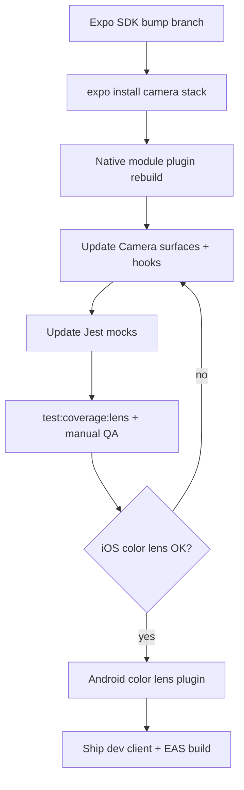

# Vision Camera v5 migration plan

This document plans the upgrade from **react-native-vision-camera 4.7.0** (current) to **v5.x**. Pair this work with an Expo SDK bump, Skia stable pin, and the Android color-lens frame processor roadmap.

**Official reference:** [Vision Camera v5 docs](https://visioncamera.margelo.com) — read the v5 migration guide before starting. Feature comparison vs our v4.7 usage: [`VISION_CAMERA_V4_VS_V5.md`](VISION_CAMERA_V4_VS_V5.md).

## Why migrate

- v5 is the actively maintained upstream line; v4 receives fewer fixes.
- Better alignment with New Architecture, Reanimated 3.19+, and Skia stable.
- Unblocks coordinated upgrades (Skia 2.6.x requires Reanimated ≥3.19.1; Expo SDK 54+ is the natural window).

## Dependency matrix (verify before merge)

| Package | Current | Target (verify at migration time) |
|---------|---------|-----------------------------------|
| `react-native-vision-camera` | 4.7.0 | 5.x per Expo / Vision Camera compatibility table |
| `react-native-worklets-core` | 1.5.0 | Version required by Vision Camera v5 release notes |
| `react-native-reanimated` | ~3.17.x | ≥3.19.1 (required by Skia stable; likely bundled with newer Expo) |
| `@shopify/react-native-skia` | v2.0.0-next.4 | Stable 2.6.x after Reanimated bump |
| `expo-color-lens-frame-processor` | local module | Rebuild Swift/Kotlin plugins against v5 JSI API |

Run `npx expo install react-native-vision-camera react-native-reanimated @shopify/react-native-skia react-native-worklets-core` on the target SDK and resolve peer conflicts before touching app code.

## Files to update (app code)

### Camera orchestration

| File | v4 usage today | Migration focus |
|------|----------------|-----------------|
| [`Camera/Camera.tsx`](Camera/Camera.tsx) | `VisionCamera` ref, `takePhoto`, `startRecording`, device/format selection, permissions | Ref types, capture APIs, format props — follow v5 breaking changes |
| [`Camera/options.ts`](Camera/options.ts) | `PhysicalCameraDeviceType` | Confirm enum / type re-exports |
| [`Camera/LensCameraSurface.tsx`](Camera/LensCameraSurface.tsx) | `useFrameProcessor`, `Reanimated.createAnimatedComponent(VisionCamera)` | Frame processor deps array, animated camera wrapper |
| [`Obskura/ObskuraCameraSurface.tsx`](Obskura/ObskuraCameraSurface.tsx) | `useSkiaFrameProcessor`, FPS cap, format templates | Skia frame processor API changes |
| [`Camera/hooks/useCameraFocus.ts`](Camera/hooks/useCameraFocus.ts) | `Camera` ref, `focus()` | Ref / method signatures |
| [`Camera/hooks/useLensPermissions.ts`](Camera/hooks/useLensPermissions.ts) | `Camera.getCameraPermissionStatus()` etc. | Permission API renames if any |

### Color lens frame processors

| File | Role |
|------|------|
| [`ColorPalette/getColorLensPalette.ts`](ColorPalette/getColorLensPalette.ts) | `VisionCameraProxy.initFrameProcessorPlugin('getColorLensPalette')` |
| [`ColorPalette/colorLensRegionFrameProcessorPlugin.ts`](ColorPalette/colorLensRegionFrameProcessorPlugin.ts) | Region plugin init |
| [`ColorPalette/getColorLensRegion.ts`](ColorPalette/getColorLensRegion.ts) | Region worklet entry |
| [`ColorPalette/useColorLensPalette.ts`](ColorPalette/useColorLensPalette.ts) | `Worklets.createRunOnJS` bridge from frame thread |
| [`ColorPalette/useColorLensRegion.ts`](ColorPalette/useColorLensRegion.ts) | Region state + worklet |

Re-run all ColorPalette and `LensCameraSurface` specs after plugin registration changes.

### Native local module

| Path | Action |
|------|--------|
| [`modules/expo-color-lens-frame-processor/`](../../../modules/expo-color-lens-frame-processor/) | Update iOS Swift frame processor to v5 plugin API; add Android implementation (roadmap item) |
| [`modules/expo-color-lens-frame-processor/package.json`](../../../modules/expo-color-lens-frame-processor/package.json) | Tighten `peerDependencies` to tested Vision Camera range |

After native changes: `npm run recharge` (prebuild + pods).

### Config

| File | Action |
|------|--------|
| [`app.json`](../../../app.json) | Vision Camera config plugin block — permission strings, microphone |
| [`babel.config.js`](../../../babel.config.js) | Confirm worklets-core + reanimated plugins order unchanged |

## Test and mock updates

| File | Action |
|------|--------|
| [`lib/testing/getObskuraVisionCameraJestMock.ts`](../../testing/getObskuraVisionCameraJestMock.ts) | Mirror v5 exports: `Camera`, `useCameraFormat`, `useSkiaFrameProcessor`, `Templates` |
| [`Camera/Camera.spec.tsx`](Camera/Camera.spec.tsx) | Full capture / navigation / alert flows |
| [`Camera/LensCameraSurface.spec.tsx`](Camera/LensCameraSurface.spec.tsx) | Frame processor throttle, plugin wiring |
| [`Obskura/ObskuraCameraSurface.spec.tsx`](Obskura/ObskuraCameraSurface.spec.tsx) | FPS, format, Skia processor mount |
| [`Camera/hooks/useCameraFocus.spec.ts`](Camera/hooks/useCameraFocus.spec.ts) | Focus animation + `runOnJS` |
| [`Camera/hooks/useLensPermissions.spec.ts`](Camera/hooks/useLensPermissions.spec.ts) | Permission alerts |

**Coverage gate:** `npm run test:coverage:lens` must stay at 100% on the configured Lens files.

## Suggested migration sequence

1. Create branch from planned Expo SDK upgrade (do not mix with unrelated features).
2. Bump Vision Camera, Reanimated, worklets-core, Skia via `expo install`.
3. Rebuild `expo-color-lens-frame-processor` native code; run on iOS device (simulator may not exercise frame processors fully).
4. Fix TypeScript and test failures file-by-file (orchestration → surfaces → plugins).
5. Manual QA checklist:
   - Lens mode: live palette, photo capture with palette save, video long-press (Lens only, color lens off).
   - Obskura: live preview at reduced FPS, still export via Skia pipeline.
   - Tap-to-focus, flash, grid, device flip, camera roll thumbnail refresh.
6. Run `npm run test:coverage:affirmations` if notification paths touched.

## Risks and mitigations

| Risk | Mitigation |
|------|------------|
| Frame processor closure deps | Audit `useFrameProcessor` / `useSkiaFrameProcessor` dependency arrays per Vision Camera v5 guidance (known Lens README item) |
| Skia paint lifecycle | Keep [`scheduleDeferredSkPaintDispose.ts`](Obskura/scheduleDeferredSkPaintDispose.ts) behavior; retest mode toggles Lens ↔ Obskura |
| Plugin name drift | Grep for `initFrameProcessorPlugin` strings; match native registrar names exactly |
| Dev client required | Document in PR; Expo Go will not validate this path |

## Out of scope for this migration

- Replacing Context + reducers with Zustand.
- MMKV / SQLite (see [`lib/storage/storage.ts`](../../storage/storage.ts) persistence note).
- FlashList changes (already on v2).

## Definition of done

- [ ] `react-native-vision-camera` at 5.x on target Expo SDK
- [ ] All Lens unit tests + `test:coverage:lens` pass
- [ ] iOS color lens frame processor works on device
- [ ] Obskura live preview + still export on iOS and Android
- [ ] [`lib/features/Lens/README.md`](README.md) Installed versions table updated
- [ ] Android color lens plugin tracked as follow-up if not in same PR
