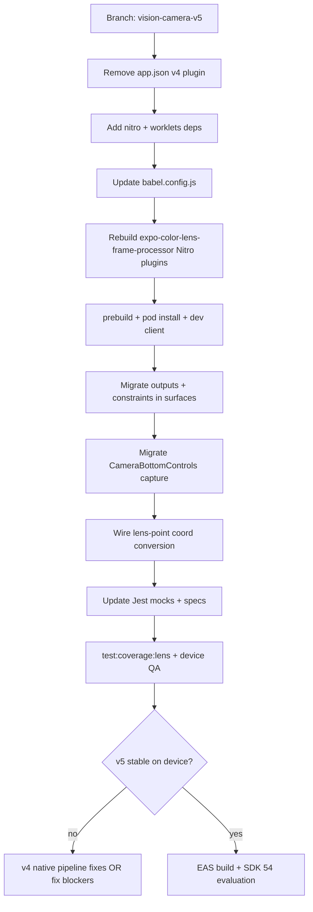

# Vision Camera v5 migration plan

This document tracked the upgrade from **react-native-vision-camera 4.7.0** to **v5.x**, including the **lens-point coordinate alignment** fix. Pair with feature comparison: [`VISION_CAMERA_V4_VS_V5.md`](VISION_CAMERA_V4_VS_V5.md).

**Official reference:** [Vision Camera v5 docs](https://visioncamera.margelo.com).

**Status:** migrated on **Expo 57** (see table below). Historical “stay on Expo 53” notes below are stale context from the original plan.

**Current app stack:**

| Package                               | Version   |
| ------------------------------------- | --------- |
| `expo`                                | 57.x      |
| `react-native`                        | 0.86.3    |
| `react-native-vision-camera`          | 5.2.3     |
| `react-native-vision-camera-worklets` | 5.2.3     |
| `react-native-vision-camera-skia`     | 5.2.3     |
| `react-native-vision-camera-resizer`  | 5.2.3     |
| `react-native-nitro-modules`          | 0.37.x    |
| `react-native-nitro-image`            | 0.15.x    |
| `react-native-reanimated`             | 4.5.1     |
| `react-native-worklets`               | 0.10.1    |
| `@shopify/react-native-skia`          | 2.6.4+    |
| `expo-color-lens-frame-processor`     | Nitro `ColorLensProcessor` (iOS) |

---

## Sequencing vs lens-point alignment

**Preferred order:** fix preview-aligned sampling on **v4.7 first** with shared native **`ColorLensImagePipeline`** (cover, orientation, mirror in Swift). Only then attempt this v5 upgrade.

v5’s native coordinate APIs can later replace the Swift cover math; they are not required to ship the alignment fix.

## Why migrate (later)

- v5 is the actively maintained upstream line; v4 receives fewer fixes.
- Native preview ↔ frame conversion can replace the v4 Swift cover pipeline.
- Better alignment with New Architecture (already enabled: `newArchEnabled: true` in `app.json`).
- Unblocks modular Skia/worklets packages and Nitro-typed frame processor plugins.

## Do we need to bump Expo SDK?

**No.** Stay on **Expo 53.0.27 / React Native 0.79.6**. Vision Camera 5 is not an Expo SDK package and does not require Expo 54+.

Evidence:

- v5 peers are `react`, `react-native`, `react-native-nitro-modules`, `react-native-nitro-image` — **not** a minimum Expo SDK.
- Official install path is `npm i` + `npx expo prebuild` + a **dev client** rebuild (Expo Go never works).
- Upstream issue [#3966](https://github.com/mrousavy/react-native-vision-camera/issues/3966) is an Expo-managed **RN 0.79.5** project that ran v5 after removing the leftover v4 config plugin — the failure was the plugin, not Expo 53.
- [#3743](https://github.com/mrousavy/react-native-vision-camera/issues/3743): **downgrading to Expo 53** made v5 compile on EAS (Xcode 16.2). SDK 54 is the riskier path because EAS auto-assigns Xcode 26 beta.

What _does_ need updating is **`expo-color-lens-frame-processor`**, but that is **not** an Expo SDK bump. It is a local native module whose iOS pod currently depends on `ExpoModulesCore` **and** `VisionCamera` (`FrameProcessorPluginRegistry`). For v5 those plugins must be rewritten as **Nitro** modules. The `expo-*` folder name is leftover packaging; the hard dependency is Vision Camera’s plugin API, not a newer `expo` package.

Leave `expo` at 53.0.27 for this migration. Treat SDK 54 as a later, separate project.

---

## Dependency matrix (as shipped)

| Package                               | Pre-migration    | Shipped                                                                                           |
| ------------------------------------- | ---------------- | ------------------------------------------------------------------------------------------------- |
| `expo`                                | 53 → 57          | **57.x** (SDK upgraded separately from the original “keep 53” plan)                               |
| `react-native`                        | 0.79.6           | **0.86.3** (SDK 57)                                                                               |
| `react-native-vision-camera`          | 4.7.0            | **5.2.3**                                                                                         |
| `react-native-nitro-modules`          | —                | **0.37.x**                                                                                        |
| `react-native-nitro-image`            | —                | **0.15.x**                                                                                        |
| `react-native-vision-camera-worklets` | —                | **5.2.3**                                                                                         |
| `react-native-worklets`               | —                | **0.10.1**                                                                                        |
| `react-native-worklets-core`          | 1.5.0            | **Removed**                                                                                       |
| `react-native-vision-camera-skia`     | —                | **5.2.3** (Obskura)                                                                               |
| `react-native-reanimated`             | 3.17.5           | **4.5.1**                                                                                         |
| `@shopify/react-native-skia`          | v2.0.0-next.4    | **2.6.4+**                                                                                        |
| `expo-color-lens-frame-processor`     | v4 FP registry   | **Nitro `ColorLensProcessor`** (lazy HybridObject); podspec at pkg root |
| `react-native-vision-camera-resizer`  | —                | **5.2.3** (dominant palette GPU cover)                                                                |

Install sequence (upstream v5.0.0 release):

```bash
npm i react-native-nitro-modules react-native-nitro-image
npm i react-native-vision-camera@5
npm i react-native-vision-camera-worklets react-native-worklets
npm i react-native-vision-camera-resizer@5
# Obskura path (when migrating Skia preview):
npm i react-native-vision-camera-skia
```

Then `npx expo prebuild` + `pod install` + **new dev client build** (Expo Go will not work).

---

## Critical config change: remove v4 Expo plugin

v5 **does not ship** an Expo config plugin. **Keeping the v4 plugin breaks startup** ([issue #3966](https://github.com/mrousavy/react-native-vision-camera/issues/3966)).

| File                            | Action                                                                                                                                                  |
| ------------------------------- | ------------------------------------------------------------------------------------------------------------------------------------------------------- |
| [`app.json`](../../../app.json) | **Delete** the `"react-native-vision-camera"` entry from `expo.plugins`                                                                                 |
| [`app.json`](../../../app.json) | **Keep** `NSCameraUsageDescription`, `NSMicrophoneUsageDescription`, Android `CAMERA` / `RECORD_AUDIO` permissions (already present outside the plugin) |

Do **not** rely on the plugin for permission strings after removal — they must remain in `infoPlist` / Android permissions.

---

## Files to update (app code)

### Camera orchestration

| File                                                                       | v4 usage today                                           | Migration focus                                                                           |
| -------------------------------------------------------------------------- | -------------------------------------------------------- | ----------------------------------------------------------------------------------------- |
| [`Camera/Camera.tsx`](Camera/Camera.tsx)                                   | Viewport tap gesture → `useCameraFocus`                  | May use v5 `focusTo` / preview metering APIs later; keep tap-to-focus behavior            |
| [`Camera/CameraBottomControls.tsx`](Camera/CameraBottomControls.tsx)       | `cameraRef.takePhoto`, `startRecording`, `stopRecording` | **`usePhotoOutput` / `useVideoOutput`**; write `Photo` to cache before `createAssetAsync` |
| [`Camera/CameraSurfaceContext.tsx`](Camera/CameraSurfaceContext.tsx)       | `cameraRef`, `useCameraDevice`                           | Hold output refs; expose photo/video outputs to bottom controls                           |
| [`Camera/options.ts`](Camera/options.ts)                                   | `PhysicalCameraDeviceType`                               | Confirm type re-exports on v5 `CameraDevice`                                              |
| [`Camera/LensCameraSurface.tsx`](Camera/LensCameraSurface.tsx)             | `useFrameProcessor`, fixed-center lens-point sampling  | **`useFrameOutput`** + VC5 coords (region) + **resizer** (dominant)    |
| [`Obskura/ObskuraCameraSurface.tsx`](Obskura/ObskuraCameraSurface.tsx)     | `useSkiaFrameProcessor`, `useCameraFormat`, `Templates`  | **`react-native-vision-camera-skia`** + **Constraints API**                               |
| [`Camera/hooks/useCameraFocus.ts`](Camera/hooks/useCameraFocus.ts)         | `cameraRef.focus({ x, y })`                              | Verify v5 focus API on preview ref / controller                                           |
| [`Camera/hooks/useLensPermissions.ts`](Camera/hooks/useLensPermissions.ts) | `useCameraPermission`, `useMicrophonePermission`         | Hooks unchanged in spirit — **not** `Camera.getCameraPermissionStatus()`                  |

### Lens point + dominant palette (shipped Nitro modernize)

**Region (lens-point):** JS-thread `convertViewPointToCameraPoint` on sample-square corners → SharedValues → worklet `convertCameraPointToFramePoint` → `copyRegion` → **`frame.dispose()`** → `extractDominantColor` (owned RGB; same MMCQ reader as palette). See [`LENS_POINT_CONTEXT.md`](LENS_POINT_CONTEXT.md).

**Dominant:** `useResizer({ scaleMode: 'cover', channelOrder: 'rgb', … })` with viewport-aspect size (long side 128) → `extractPalette(ArrayBuffer, w, h)`.

### Color lens frame processors

| File                                                                         | Role                                                                 |
| ---------------------------------------------------------------------------- | -------------------------------------------------------------------- |
| [`ColorPalette/getColorLensPalette.ts`](ColorPalette/getColorLensPalette.ts) | `getColorLensProcessor().extractPalette(pixels, w, h)`               |
| [`ColorPalette/getColorLensRegion.ts`](ColorPalette/getColorLensRegion.ts)   | `copyRegion` + `extractDominantColor` (dispose Frame between) |
| [`ColorPalette/useColorLensPalette.ts`](ColorPalette/useColorLensPalette.ts) | Palette SharedValues mutated on the frame thread                     |
| [`ColorPalette/useColorLensRegion.ts`](ColorPalette/useColorLensRegion.ts)   | Region color SharedValue mutated on the frame thread                 |

### Native local module

| Path                                                                                                                    | Action                                                                 |
| ----------------------------------------------------------------------------------------------------------------------- | ---------------------------------------------------------------------- |
| [`modules/expo-color-lens-frame-processor/`](../../../modules/expo-color-lens-frame-processor/)                         | Single **`ColorLensProcessor`** Nitro HybridObject (iOS Swift)         |
| [`modules/expo-color-lens-frame-processor/package.json`](../../../modules/expo-color-lens-frame-processor/package.json) | Peers: `react-native-nitro-modules`, `react-native-vision-camera` ≥5 |
| Android                                                                                                                 | **Out of scope**                                                       |

After native changes: `pod install` + rebuild dev client. Lens unit coverage for the new processor path is deferred until before ship.

### Babel / worklets

| File                                          | Action                                                                                                                                                  |
| --------------------------------------------- | ------------------------------------------------------------------------------------------------------------------------------------------------------- |
| [`babel.config.js`](../../../babel.config.js) | Replace `react-native-worklets-core/plugin` with **`react-native-worklets/plugin`** per v5 install docs; keep **`react-native-reanimated/plugin` last** |

---

## Test and mock updates

| File                                                                                               | Action                                                                                                                              |
| -------------------------------------------------------------------------------------------------- | ----------------------------------------------------------------------------------------------------------------------------------- |
| [`lib/testing/getObskuraVisionCameraJestMock.ts`](../../testing/getObskuraVisionCameraJestMock.ts) | Mirror v5: `usePhotoOutput`, `useVideoOutput`, `useFrameOutput`, `constraints`; drop `useCameraFormat` / `Templates` unless shimmed |
| [`Camera/Camera.spec.tsx`](Camera/Camera.spec.tsx)                                                 | Capture via photo/video outputs; mock coordinate conversion if tested                                                               |
| [`Camera/CameraBottomControls.spec.tsx`](Camera/CameraBottomControls.spec.tsx)                     | `capturePhoto` instead of `takePhoto`                                                                                               |
| [`Camera/LensCameraSurface.spec.tsx`](Camera/LensCameraSurface.spec.tsx)                           | Frame output handler; assert region plugin receives **converted** frame coords                                                      |
| [`Obskura/ObskuraCameraSurface.spec.tsx`](Obskura/ObskuraCameraSurface.spec.tsx)                   | Skia package + constraints                                                                                                          |
| [`Camera/hooks/useCameraFocus.spec.ts`](Camera/hooks/useCameraFocus.spec.ts)                       | Focus API signatures                                                                                                                |
| [`Camera/hooks/useLensPermissions.spec.ts`](Camera/hooks/useLensPermissions.spec.ts)               | Permission hooks                                                                                                                    |

**Coverage gate:** `npm run test:coverage:lens` must stay at 100% on configured Lens files.

---

## Suggested migration sequence


```mermaid
flowchart TD
  A[Branch: vision-camera-v5] --> B[Remove app.json v4 plugin]
  B --> C[Add nitro + worklets deps]
  C --> D[Update babel.config.js]
  D --> E[Rebuild expo-color-lens-frame-processor Nitro plugins]
  E --> F[prebuild + pod install + dev client]
  F --> G[Migrate outputs + constraints in surfaces]
  G --> H[Migrate CameraBottomControls capture]
  H --> I[Wire lens-point coord conversion]
  I --> J[Update Jest mocks + specs]
  J --> K[test:coverage:lens + device QA]
  K --> L{v5 stable on device?}
  L -->|no| M[v4 native pipeline fixes OR fix blockers]
  L -->|yes| N[EAS build + SDK 54 evaluation]
```

### Phase checklist

1. **Prep** — Remove v4 Expo plugin; add Nitro/worklets packages; update Babel.
2. **Native plugins** — Rewrite `getColorLensPalette` + `getColorLensRegion` as Nitro modules; device-test on iOS.
3. **Camera surfaces** — Constraints + outputs on Lens and Obskura surfaces; migrate Skia to optional package.
4. **Capture path** — `CameraBottomControls` uses photo/video outputs; persist `Photo` to file for `createAssetAsync`.
5. **Lens point coords** — View → camera → frame conversion in frame output handler; verify indicator tracks sampled color at center and corners.
6. **Tests** — Mocks + 100% Lens coverage gate.
7. **QA** — Manual device checklist (below).
8. **Follow-ups** — Android color lens plugin; SDK 54/EAS when Xcode image stable.

### Manual QA checklist

- Lens mode, color lens off: photo + video long-press capture.
- Lens dominant mode: live palette + photo saves palette.
- Lens point mode: fixed-center indicator; **sampled color matches object at screen center** (back + front camera); movable drag deferred to a later project.
- Obskura: live filtered preview at reduced FPS; still export via Skia pipeline.
- Tap-to-focus, flash, grid, flip, lens device toggle, camera roll thumbnail refresh.
- Lens ↔ Obskura view mode toggle (no crash; Skia paint dispose).

---

## Risks and mitigations

| Risk                                        | Mitigation                                                                                                                 |
| ------------------------------------------- | -------------------------------------------------------------------------------------------------------------------------- |
| v4 Expo plugin left in `app.json`           | Delete plugin block first; document in PR                                                                                  |
| Nitro plugin rewrite blocks entire upgrade  | Time-box native work; v4 Swift pipeline already handles preview alignment                                                  |
| EAS SDK 54 + Xcode 26 beta compile failures | Stay on SDK 53 for first v5 merge; track [issue #3743](https://github.com/mrousavy/react-native-vision-camera/issues/3743) |
| Frame processor closure deps                | Audit frame output handler deps per v5 guidance                                                                            |
| Skia paint lifecycle                        | Keep [`scheduleDeferredSkPaintDispose.ts`](Obskura/scheduleDeferredSkPaintDispose.ts); retest mode toggles                 |
| Preview conversion not in worklet           | Split: JS updates cameraPoint shared value; worklet only converts camera → frame                                           |
| Plugin name drift                           | Grep `initFrameProcessorPlugin` / Nitro registrar names; match exactly                                                     |
| Dev client required                         | Document in PR; Expo Go invalid                                                                                            |

---

## Out of scope for this migration

- Android `getColorLensRegion` / `getColorLensPalette` native plugins (track separately).
- Replacing Context + reducers with Zustand.
- MMKV / SQLite storage migration.
- FlashList changes.

---

## Definition of done

- [ ] `react-native-vision-camera` at 5.x; Nitro + worklets deps installed
- [ ] v4 Expo config plugin **removed** from `app.json`
- [ ] `expo-color-lens-frame-processor` rebuilt as v5 Nitro plugins (iOS)
- [ ] Lens + Obskura surfaces use outputs + constraints
- [ ] Capture/recording migrated off `cameraRef.takePhoto` / `startRecording`
- [ ] Lens point indicator aligned with sampled region (coordinate conversion wired)
- [ ] All Lens unit tests + `test:coverage:lens` pass
- [ ] iOS device QA passes manual checklist
- [ ] [`lib/features/Lens/README.md`](README.md) Installed versions table updated
- [ ] Android color lens plugin tracked as follow-up if not in same PR
